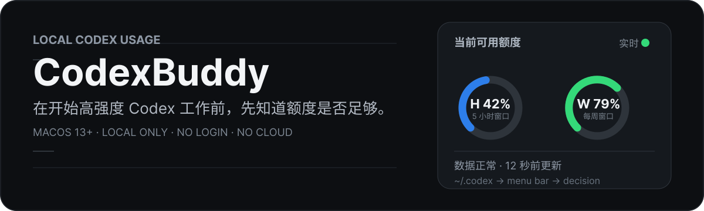
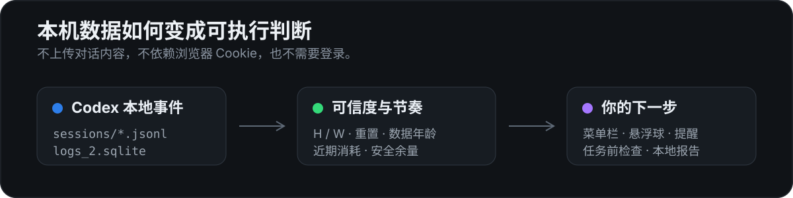

<p align="center">
  
</p>

<p align="center">
  <a href="https://github.com/zhouxuan3550/CodexBuddy/releases"></a>
  <a href="https://github.com/zhouxuan3550/CodexBuddy"></a>
  <a href="./LICENSE"></a>
</p>

<p align="center"><strong>一个原生、只在本机工作的 macOS Codex 用量助手。</strong><br>在你准备开始高强度任务前，一眼判断：现在能不能放心用、额度何时恢复、是否该控制节奏。</p>

> 非官方第三方项目，与 OpenAI 不存在隶属、赞助或背书关系。Codex 与 OpenAI 名称及相关商标归其权利人所有。

## 下载

| 你的 Mac | 下载 |
| --- | --- |
| Apple Silicon（M1 / M2 / M3 / M4） | [打开 Releases，选择 `arm64` DMG](https://github.com/zhouxuan3550/CodexBuddy/releases/latest) |
| Intel Mac | [打开 Releases，选择 `x86_64` DMG](https://github.com/zhouxuan3550/CodexBuddy/releases/latest) |

下载后将 `CodexBuddy.app` 移到“应用程序”文件夹并打开即可。首次打开若被 macOS 拦截，请在“系统设置 → 隐私与安全性”中确认允许。

<p align="center">
  
</p>

## 它帮你做什么判断？

| 你想知道 | CodexBuddy 给出的信息 |
| --- | --- |
| 现在能不能放心开始？ | H / W 剩余额度、每周安全余量与任务前检查结论 |
| 按这个节奏会怎样？ | 近期消耗速度、预计耗尽时间、重置时间与额度富余提示 |
| 这个数字可信吗？ | 数据来源、更新时间、过期状态与可导出的诊断报告 |

## 为 Codex 而做，不扩张成仪表盘

- **菜单栏额度**：支持 `W 79%`、`H --% W 79%`、最紧张额度和今日 Tokens；低于 20% 标红、高于 60% 标绿。
- **任务前检查**：结合每周额度、安全余量、重置时间与近期消耗趋势，给出“可以开始 / 建议控制 / 建议等待”的结论。
- **本地洞察**：趋势、项目、模型、缓存命中率与 Token 活动只读取本机 Codex 记录；零碎条目不会挤占详情面板。
- **有分寸的提醒**：低额度、预测耗尽、临近重置、每周复盘和额度富余都按周期去重，避免反复打扰。
- **四种工作模式**：极简、标准、专注、诊断；普通用户无需理解一堆显示开关，仍可切换到自定义显示。
- **自动化入口**：支持全局快捷键、URL Scheme、CSV、诊断报告，以及 DMG 内置的 `codexbuddy` 命令行助手。

## 数据如何变成结论？

<p align="center">
  
</p>

CodexBuddy 优先读取 `~/.codex/sessions/**/*.jsonl` 中的 `token_count.rate_limits` 事件，并以 `~/.codex/logs_2.sqlite` 的响应头作备用来源。它只解析额度窗口、恢复时间、套餐名称和余额字段。

**不会读取**对话正文、`auth.json`、浏览器 Cookie 或浏览器数据库；也不会模拟登录或上传任何数据。

## 工作模式

| 模式 | 默认表现 | 适合谁 |
| --- | --- | --- |
| 极简 | 菜单栏只显示 `W 79%` | 只想确认每周额度的人 |
| 标准 | 显示 `H --%  W 79%` | 日常 Codex 开发 |
| 专注 | 开启悬浮球；低于提醒阈值才突出 | 不想被数字持续打扰的人 |
| 诊断 | 菜单增加来源、更新时间与原始窗口状态 | 排查数据异常时 |

## 3 分钟开始使用

1. 下载适合芯片的 DMG，并将应用移到“应用程序”。
2. 正常使用 Codex；CodexBuddy 会监听本机的新用量事件并自动更新。
3. 点击菜单栏读数查看恢复时间和数据状态；需要长任务时打开“任务前检查”。

### 自动化

```text
codexbuddy://dashboard   # 打开用量详情
codexbuddy://preflight   # 打开任务前检查
codexbuddy://settings    # 打开设置
codexbuddy://refresh     # 立即刷新
```

DMG 内含命令行助手：

```sh
/Applications/CodexBuddy.app/Contents/Resources/codexbuddy preflight --copy
```

它会刷新用量并把任务前检查结论复制到剪贴板，适合 Raycast、Alfred 与 Shell 工作流。

<details>
<summary><strong>本地构建与开发</strong></summary>

需要 macOS 13+ 与 Xcode Command Line Tools。

```sh
./scripts/test.sh
ARCHS="arm64 x86_64" ./scripts/build.sh
./scripts/package-release.sh
```

构建结果位于 `build/CodexBuddy.app`；双架构的 DMG、ZIP 与 SHA-256 校验文件位于 `build/`。

</details>

## 开源与来源

CodexBuddy 当前源代码采用 [MIT License](./LICENSE)。早期开发历史的来源与许可证边界见 [THIRD_PARTY_NOTICES.md](./THIRD_PARTY_NOTICES.md)。欢迎提交 Issue 和 Pull Request。
